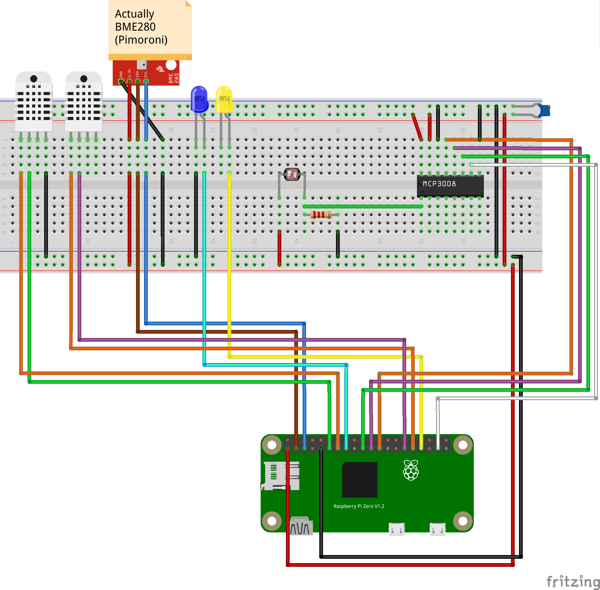

# PI Weather station

This project contains an ansible playbook for my pi weather station

## Hardware:

- PI Zero W
- AM2302
- BME280 (Pimoroni Breakout board)

## Diagram

## Software
The software is written in python and gets deployed via ansible to my pi

## Playbooks

There are two playbooks, the main.yml deploys everything, python.yml is used to update